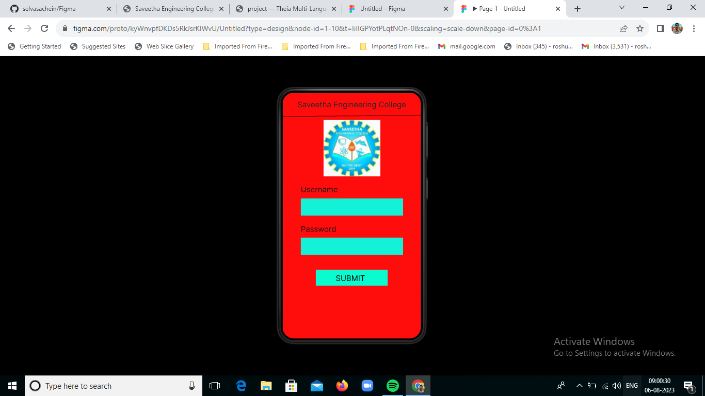
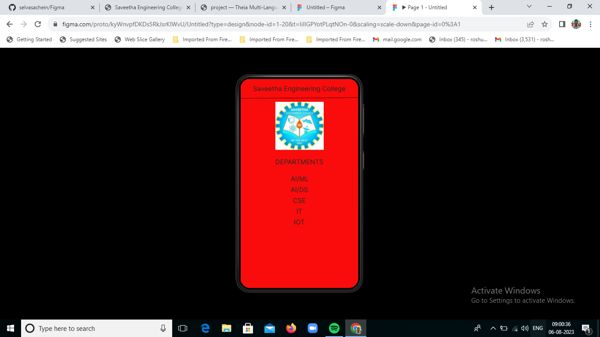

# Event Registration Web Application

## AIM:
To design, develop and deploy a web application for event registration.

## DESIGN STEPS:
### Step 1:
Create a new frame.

### Step 2:
Select any one preset size of your choice.

### Step 3:
Select the shapes you need.

### Step 4:
Import images as needed.

### Step 5:
Create pages based on your need and link them.


### Step 6:
Publish the website in the given URL.

## DESIGN TOOL :
Figma

## PROGRAM :
```py
/*Home Page*/
position: relative;
width: 360px;
height: 640px;
background: #F90B0B;

/*Login Page*/
position: relative;
width: 360px;
height: 640px;
background: #FF0D0D;

/*Saveetha Engineering College*/
position: absolute;
width: 319px;
height: 52px;
flex-shrink: 0;
color: #272525;
text-align: center;
font-family: Inter;
font-size: 20px;
font-style: normal;
font-weight: 400;
line-height: normal;

/*Departments*/
position: absolute;
width: 319px;
height: 52px;
flex-shrink: 0;
color: #272525;
text-align: center;
font-family: Inter;
font-size: 20px;
font-style: normal;
font-weight: 400;
line-height: normal;

/*AI/ML*/
position: absolute;
width: 319px;
height: 52px;
flex-shrink: 0;
color: #272525;
text-align: center;
font-family: Inter;
font-size: 20px;
font-style: normal;
font-weight: 400;
line-height: normal;

/*AI/DS*/
position: absolute;
width: 319px;
height: 52px;
flex-shrink: 0;
color: #272525;
text-align: center;
font-family: Inter;
font-size: 20px;
font-style: normal;
font-weight: 400;
line-height: normal;

/*CSE*/
position: absolute;
width: 319px;
height: 52px;
flex-shrink: 0;
color: #272525;
text-align: center;
font-family: Inter;
font-size: 20px;
font-style: normal;
font-weight: 400;
line-height: normal;

/*IT*/
position: absolute;
width: 319px;
height: 52px;
flex-shrink: 0;
color: #272525;
text-align: center;
font-family: Inter;
font-size: 20px;
font-style: normal;
font-weight: 400;
line-height: normal;

/*IOT*/
position: absolute;
width: 319px;
height: 52px;
flex-shrink: 0;
color: #272525;
text-align: center;
font-family: Inter;
font-size: 20px;
font-style: normal;
font-weight: 400;
line-height: normal;
```

## OUTPUT:




## Result:
The program to design, develop and deploy a web application for event registration is completed successfully.
